[](https://pypi.org/project/pyhrv/)

[](https://github.com/PGomes92/pyhrv/issues)

[](https://pyhrv.readthedocs.io/en/latest/)


pyHRV is an open-source Python toolbox that computes state-of-the-art Heart Rate Variability (HRV) parameters from Electrocardiography (ECG), SpO2, Blood Volume Pulse (BVP), or other signals with heart rate indicators.

With pyHRV, we aim to provide a user-friendly and versatile Python toolbox for HRV dedicated education, research, and application development.

It provides provides comprehensible source code to help beginners understand the fundamentals of HRV parameter computation, while providing the most important HRV analysis functionalities for developers and publication-quality plots of the results for researchers.
# Getting Started

### Installation
This toolbox can be installed using the ```pip``` tool (works for Python 2 and 3):

```python
pip install pyhrv
```

Dependencies: [biosppy](https://github.com/PIA-Group/BioSPPy) | [numpy](http://www.numpy.org) | [scipy](http://scipy.org) | [matplotlib](https://matplotlib.org) | [nolds](https://github.com/CSchoel/nolds) | [spectrum](https://github.com/cokelaer/spectrum)

### Documentation & Tutorials
Detailed pyHRV documentation is available on ReadTheDocs:

[pyHRV API Reference](https://pyhrv.readthedocs.io)

Additional tutorials can be found here:

[pyHRV Quickstart Guide](./pyhrv/README.md)<br>
[Tutorial: From ECG acquisition to HRV analysis with pyHRV](https://pyhrv.readthedocs.io/en/latest/_pages/tutorials.html)

### Scientific Background
The HRV algorithms have been developed and implemented according to the [Heart Rate Variability - Sandards of 
Measurement, Physiological Interpretation, and Clinical Use Guidelines](https://www.ahajournals.org/doi/full/10.1161/01.CIR.93.5.1043). Other references are noted in the code and in the [pyHRV references](./pyhrv/references.txt).

### Citing pyHRV
Please use the following conference paper to cite pyHRV in your work:

*P. Gomes, P. Margaritoff, and H. P. da Silva, “pyHRV: Development and evaluation of an open-source python toolbox for
 heart rate variability (HRV),” in Proc. Int’l Conf. on Electrical, Electronic and Computing Engineering (IcETRAN), pp. –, 2019*

```latex
@inproceedings{Gomes2019,
   author = {Gomes, Pedro and Margaritoff, Petra and Silva, Hugo},
   booktitle = {Proc. Int'l Conf. on Electrical, Electronic and Computing Engineering (IcETRAN)},
   pages = {X-X},
   title = {{pyHRV: Development and evaluation of an open-source python toolbox for heart rate variability (HRV)}},
   year = {2019}
}
```
<sup>Note: The conference paper has not been made publicly available. The missing page indication will updated once 
the paper is available</sup>

# pyHRV Core Features & HRV Parameter List

With pyHRV, you can compute up to 78 HRV parameters while using other useful non-parameter-specific tools to support 
your HRV research.

### Basic Tools & Features

- Computation of NNI series
- Computation of ∆NNI series
- Computation of HR series
- Signal segmentation into segments of specified durations
- ECG plotting on medical-grade-like ECG paper layout
- Tachogram plotting
- HRV result export and import(.json format)
- HRV report generation (.txt and .csv format)


New in version 0.4:
- LaTeX powered HRV PDF report generation (BETA) ([SampleReport](./SampleFigures/SampleReport.pdf))
- Heart Rate Heatplot - Visualization & classification of HR performance based on normal HR ranges by age and gender


### Time Domain Parameters

|  Time Domain Parameter     		         |  Description |
|  ---                     |  ---         |
|  NNI<sub>min</sub><br>NNI<sub>max</sub><br>NNI<sub>mean</sub> | Basic statistical parameters of a NNI series  |
|  ΔNNI<sub>min</sub><br>ΔNNI<sub>max</sub><br>ΔNNI<sub>mean</sub><br>ΔNNI<sub>max{ΔNNI<sub>max</sub>-ΔNNI<sub>min</sub>}</sub> | Basic statistical parameters of a ΔNNI series |
|  HR<sub>min</sub><br>HR<sub>max</sub><br>HR<sub>mean</sub><br>σ(HR) | Basic statistical parameters of an HR series |
|  SDNN                    |  Standard deviation of a NNI series  |
|  SDNN<sub>index</sub>    |  Mean of the SDNN of 5 successive 5 minute segments extracted from long-term NNI series |
|  SDANN                   |  Standard deviation of the mean of 5 minute segments extracted from long-term NNI series |
|  RMSSD                   |  Root mean square of successive differences   |
|  SDSD                    |  Standard deviation of successive differences |
|  NNx<sup>1</sup>         |  Number of NNI > x ms |
|  pNNx<sup>1</sup>        |  Ratio between the NNx value and the total number of NNI |
<sup><sup>1</sup> function available with selectable threshold; functions for traditional 50ms (NN50 & pNN50) and 
20ms 
(NN20 & pNN20) are also available</sup>

pyHRV also provides functions for the computation of the geometrical parameters of the Time Domain including the 
NNI Histogram plot as shown below.

|  Geometrical Parameters  |  Description       |
|  ---                     |  ---               |
|  TRI                     |  Triangular index  (Maximum of the Histogram / Width of the Histogram)|
|  TINN<sup>2</sup>        |  Baseline width of the NNI Histogram based on a triangular interpolation function |

<sup><sup>2</sup> the current version of pyHRV has some bug which causes misleading and false results for the TINN 
function. [An issue has already been open for this purpose...](https://github.com/PGomes92/pyhrv/issues/5)

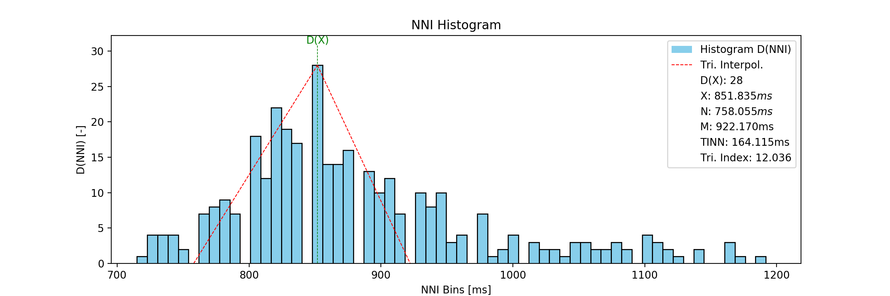


### Frequency Domain Parameters
Computes the following Frequency Domain parameters from the Power Spectral Density (PSD) of a NNI series computed 
using the following PSD methods:

- Welch's Method - ```pyhrv.frequency_domain.welch_psd()``` [[source](https://github.com/PGomes92/pyhrv/blob/b5c5baaa8bf1ad085dc2dfe46b477171fe153682/pyhrv/frequency_domain.py#L69)]

- Welch's Method - ```pyhrv.frequency_domain.ar_psd()``` [[source](https://github.com/PGomes92/pyhrv/blob/b5c5baaa8bf1ad085dc2dfe46b477171fe153682/pyhrv/frequency_domain.py#L398)]

- Welch's Method - ```pyhrv.frequency_domain.lomb_psd()``` [[source](https://github.com/PGomes92/pyhrv/blob/b5c5baaa8bf1ad085dc2dfe46b477171fe153682/pyhrv/frequency_domain.py#L239)]

The following parameters are computed from the PSDs:

- Peak Frequencies
- Absolute Powers
- Logarithmic Powers
- Relative Powers
- Normalized Powers (LF and HF only)
- LF/HF ratio

The parameters are computed for the Very Low Frequency (VLF), Low Frequency (LF), and High Frequency (HF) bands. The 
Frequency Bands can be customized and specified, including an Ultra Low Frequency (ULF) band.

Sample plots of the resulting PSD plots and Frequency Domain parameters using pyHRV functions can be seen below:


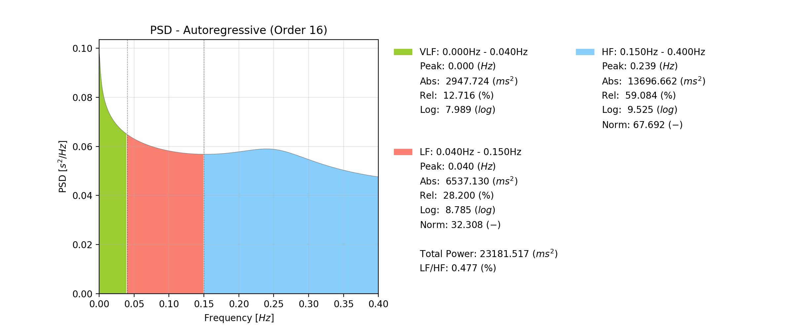

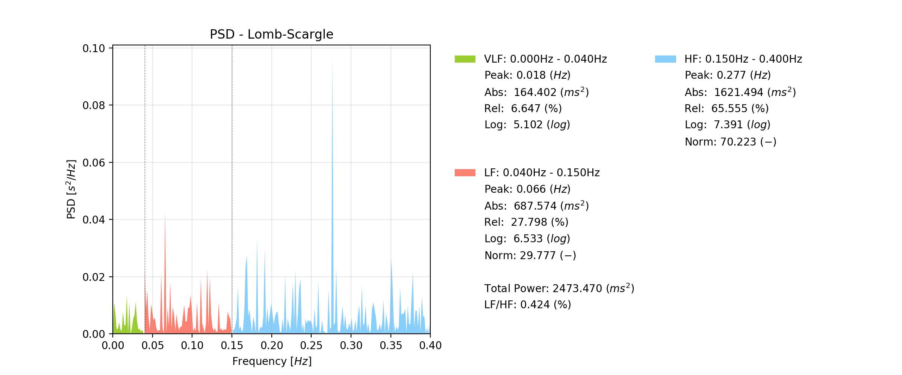

#### PSD Comparison Features - 2D Comparison Plot
Plot PSDs from multiple NNI segments extracted from a NNI series (e.g. 5 minute segments of a 60 minute recording) in a 3D Waterfall Plot using the Welch, Autoregressive or Lomb-Scargle method and compute the Frequency Domain parameters from each segment (function: ```pyhrv.frequency_domain.psd_comparison()``` [[source](https://github.com/PGomes92/pyhrv/blob/b5c5baaa8bf1ad085dc2dfe46b477171fe153682/pyhrv/frequency_domain.py#L970)]).

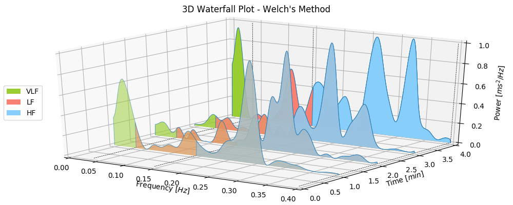

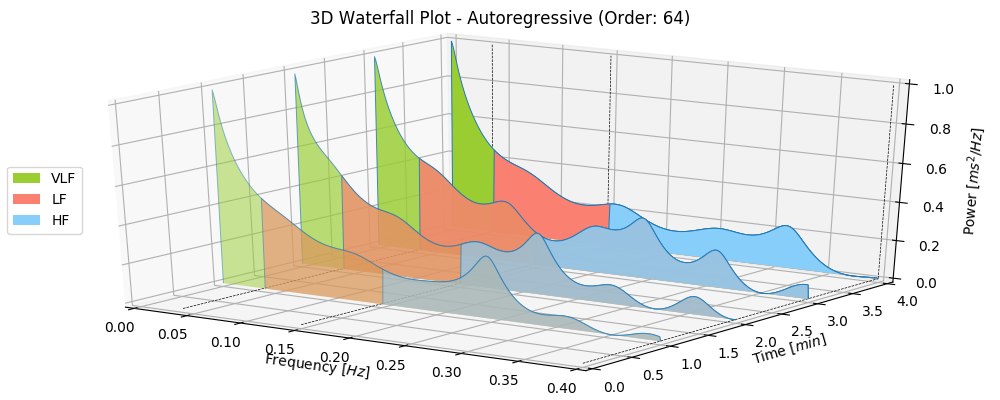

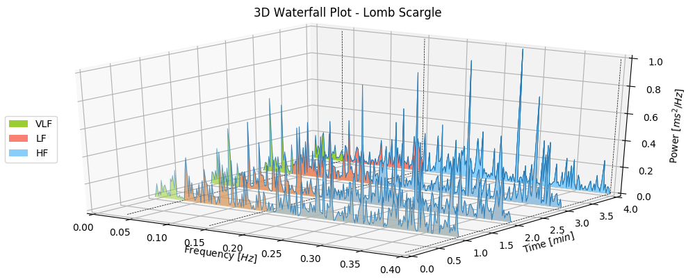

#### PSD Comparison Features - 3D Waterfall Plot
Plot PSDs from multiple NNI segments extracted from a NNI series (e.g. 5 minute segments of a 60 minute recording) in a single plot using the Welch, Autoregressive or Lomb-Scargle method and compute the Frequency Domain parameters from each segment (function: ```pyhrv.frequency_domain.psd_waterfall()``` [[source](https://github.com/PGomes92/pyhrv/blob/b5c5baaa8bf1ad085dc2dfe46b477171fe153682/pyhrv/frequency_domain.py#L1317)]).

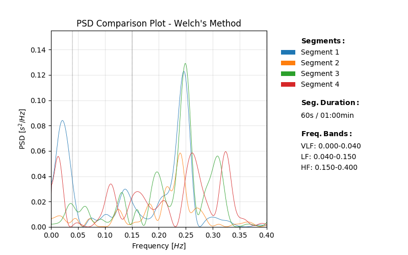
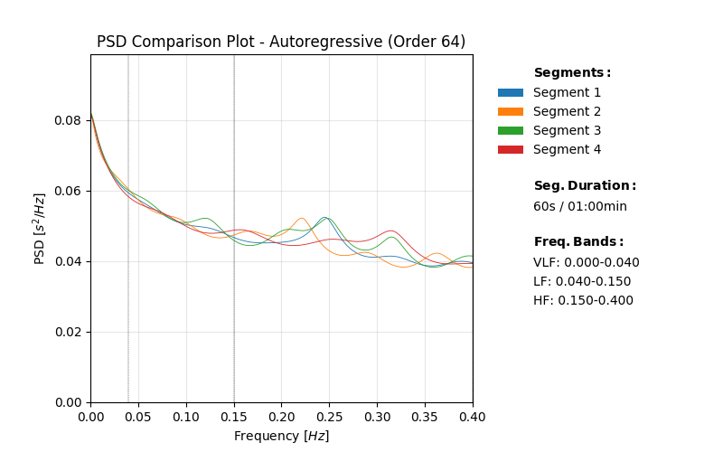
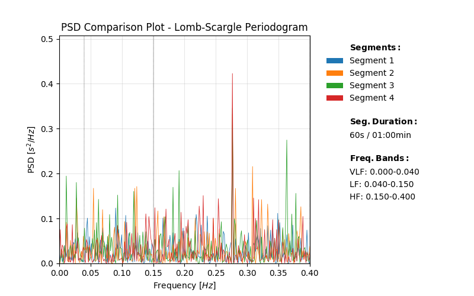

## Nonlinear Parameters
- Poincaré Plot (SD1, SD2, fittes ellipse area, SD2/SD1 ratio)
- Sample Entropy
- Detrended Fluctuation Analysis (short-term and long-term)


## Sample Figures

### Frequency Domain - Autoregressive Method

### Nonlinear - Poincaré & Detrended Fluctuation Analysis
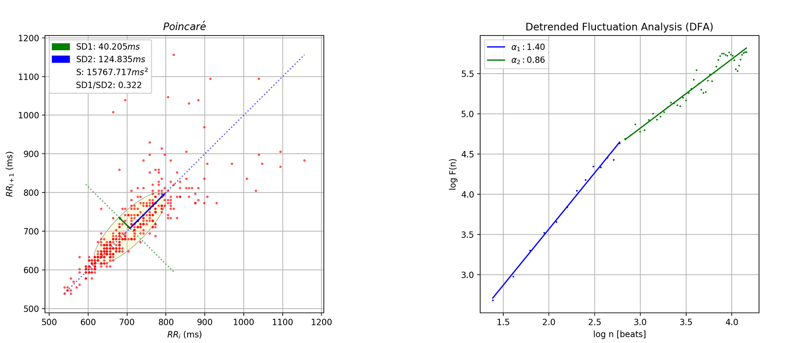

### Comparison & Analysis support features

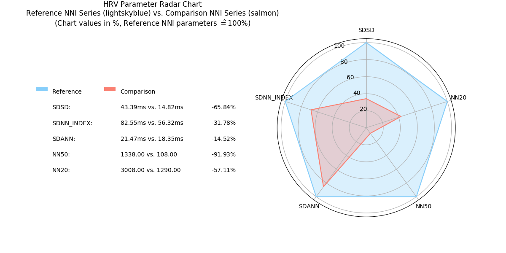

# Disclaimer
This program is distributed in the hope it will be useful and provided to you "as is", but WITHOUT ANY WARRANTY, without even the implied warranty of MERCHANTABILITY or FITNESS FOR A PARTICULAR PURPOSE. This program is NOT intended for medical diagnosis. We expressly disclaim any liability whatsoever for any direct, indirect, consequential, incidental or special damages, including, without limitation, lost revenues, lost profits, losses resulting from business interruption or loss of data, regardless of the form of action or legal theory under which the liability may be asserted, even if advised of the possibility of such damages.


This package has initially (up to version 0.3) been developed within the scope of my master thesis _"Development of an 
Open-Source Python Toolbox for Heart Rate Variability (HRV)"_ at the [University of Applied Sciences Hamburg, Germany (Faculty Life Sciences, Department of Biomedical Engineering)](https://www.haw-hamburg.de/fakultaeten-und-departments/ls/studium-und-lehre/master-studiengaenge/mbme.html) and [PLUX wireless biosignals, S.A.](http://www.plux.info), Lisbon, Portugal.