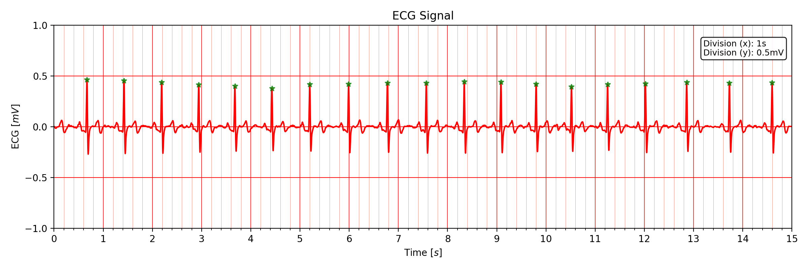
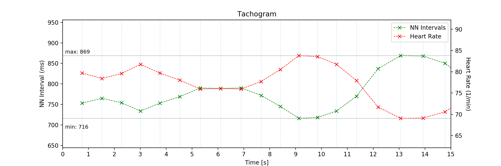
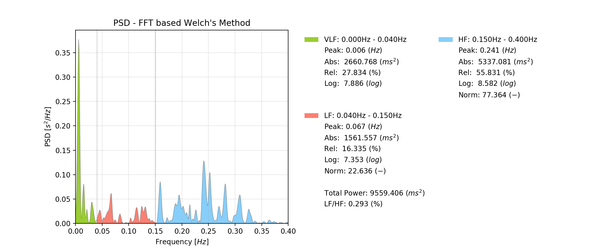
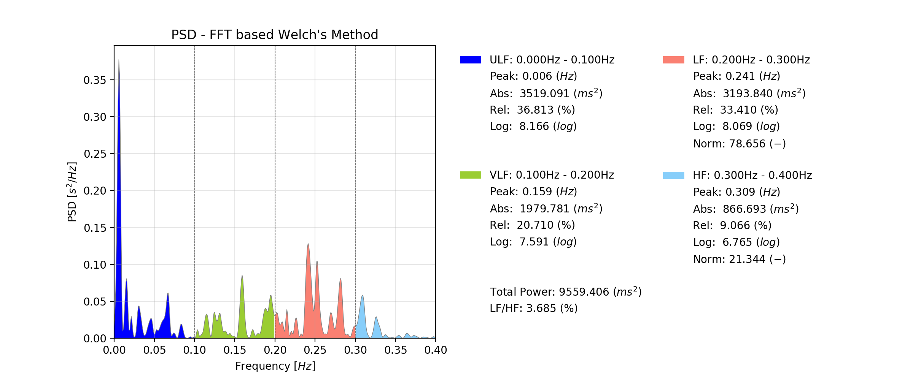
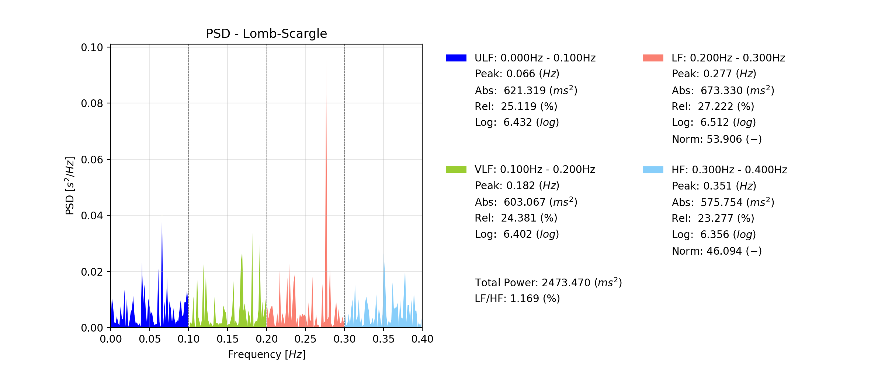
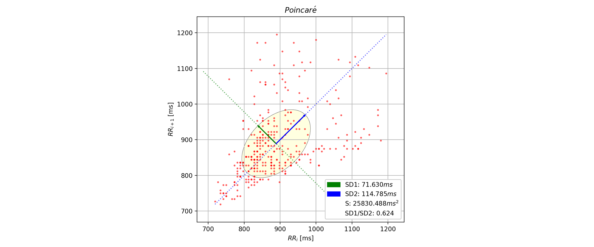
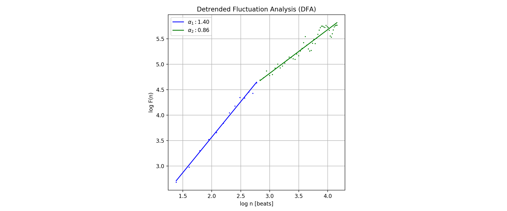

# Overview & Quickstart

## Table of Contents
* [0. Getting Started](#start)
  * [0.1 Install pyHRV](#install)
  * [0.2 Sample Data](#samples)
  * [0.3 pyHRV Output Format](#output)
* [1. pyHRV Structure](#structure)
* [2. Tools Module](#tools)
  * [2.1 Overview](#tools_overview)
  * [2.2 Quickstart](#tools_quick)
    * [2.2.1 Load ECG, Compute NNI and ∆NNI Series](#tools_quick_start)
    * [2.2.2 Plot ECG Signals](#tools_plot_ecg)
    * [2.2.3 Plot Tachogram](#tools_tachogram)
    * [2.2.4 HRV File Management and HRV report](#tools_filem)
* [3. Time Domain Module](#time)
  * [3.1 Overview](#time_overview)
  * [3.2 Quickstart](#time_quick)
    * [3.2.1 Compute Individual Time Domain Parameters](#time_quick_parameter)
    * [3.2.2 Compute All Time Domain Parameters at Once](#time_quick_module)
* [4. Frequency Domain Module](#freq)
  * [4.1 Overview](#freq_overview)
  * [4.2 Quickstart](#freq_quick)
    * [4.2.1 Welch's Method](#freq_welch)
    * [4.2.2 Lomb-Scargle Periodogram](#freq_welch)
    * [4.2.3 Compute All PSD Methods at Once](#freq_quick_module)
* [5. Nonlinear Module](#nonlinear)
  * [5.1 Overview](#nonlinear_overview)
  * [5.2 Quickstart](#nonlinear_quick)
    * [5.2.1 Compute Individual Nonlinear Parameters](#nonlinear_quick_parameter)
    * [5.2.2 Compute All Nonlinear Parameters at Once](#nonlinear_quick_module)


##### List of Acronyms
(sorted by order of appearance)

* NNI 	Normal-to-Normal Interval (between succesive R-peaks)
* ∆NNI	Difference between successive NNI
* HR    Heart Rate
* PSD 	Power Spectral Density
* FFT 	Fast Fourier Transform
* ULF		Ultra Low Frequency
* VLF		Very Low Frequency
* LF		Low Frequency
* HF 		High Frequency
* DFA Detrended Flucutation Analysis

# 0. Getting Started <a name="start"></a>
## 0.1 Install pyHRV <a name="install"></a>
Open your terminal and install `pyhrv` using the pip tool with the following command:

```python
pip install pyhrv
```

## 0.2 Sample Data <a name="samples"></a>
This package comes with ECG and NNI sample data which can be found in the `./samples/` folder. 

The `SampleECG.txt` file contains the offical [BITalino sample ECG signal](https://github.com/BITalinoWorld/revolution-sample-data/tree/master/ECG) acquired with a [BITalino revolution](http://bitalino.com/en/) device and the [OpenSignals revolution](http://bitalino.com/en/software) software. The examples below use the [OpenSignalsReader](https://github.com/PGomes92/opensignalsreader) to read the ECG data from the `SampleECG.txt` file, however, any other ECG sensor works as well.

The NNI series stored in the `series_X` files (.npy or .txt) are segments of 5min in duration extracted from the [MIT-BIH NSRDB Database (physionet.org)](https://physionet.org/physiobank/database/nsrdb/).

## 0.3 pyHRV Output Format <a name="output"></a>
The toolbox's parameter functions return all computed HRV parameters in a single `biosppy.utils.ReturnTuple`[(more info)](https://biosppy.readthedocs.io/en/stable/biosppy.html#biosppy.utils.ReturnTuple) object. These objects are a mix of Python tuples (immutable) which are indexed using _keys_ as used in Python dictionaries. 

Please refer to the [hrv_keys.json](./files/hrv_keys.json) file found in the [files](./files/) folder to access the full list of available parameter keys.

# 1. pyHRV Structure <a name="structure"></a>
[coming soon]

# 2. Tools Module <a name="tools"></a>
## 2.1 Overview <a name="tools_overview"></a>
The tools module contains a selection of functions to compute fundamental data series for HRV computation and other useful features (e.g., ECG signal plotting, HRV parameter exportation). A full list of the available functions is listed in the table below.

| Function   		      | Description                                               								|
| ---                 | ---                                                       								|
| `nn_intervals()`    | Computes NNI from a series of R-peak locations                    |
| `nn_diff()`        	| Computes ∆NNI from a series of NNI or R-peak locations    								|
| `nn_format()`			  | Confirms NumPy and converts NNI series in s-format to ms 									|
| `heart_rate()`     	| Computes HR data from individual NNI or R-peak locations  								|
| `tachogram()`      	| Plots NNI and HR Tachogram                                								|
| `ecg_plot()`        | Plots ECG signal on medical-grade-like ECG 												|
| `segmentation()` 		| Segments NNI series into segments of specified duration									|
| `hrv_export()` 		  | Exports HRV results to a .JSON file 														|
| `hrv_import()` 		  | Imports HRV results stored in a .JSON file 												|
| `hrv_report()`    	| Generates HRV report in .TXT or .CSV format 												|
| `join_tuples()` 		| Joins multiple `biosppy.utils.ReturnTuple` objects into 1 object 							|
| `time_vector()`		  | Computes the time vector for a given signal 												|
| `std()`				      | Computes standard deviation of a data series 												|
| `check_input()`    | Verifies input data for (almost) all parameter funtions 									|
| `check_interval()`	| Verifies interal limits (e.g. fixes max(limit) < min(limit))								|

(weak module functions are not listed in this table)

## 2.2. Quickstart <a name="tools_quick"></a>
In order to use this module, it is recommended to import it as follows:
```python
import pyhrv.tools as tools
```

### 2.2.1 Load ECG, Extract R-peaks and Compute NNI <a name="tools_quick_stat"></a>
The example below demonstrates how to load an ECG signal (here the [BITalino](www.bitalino.com) sample ECG signal), extract the R-peak locations and compute the NNI series.
```python
import biosppy
import numpy as np
import pyhrv.tools as tools
from opensignalsreader import OpenSignalsReader 

# Load sample ECG signal & extract R-peaks using BioSppy
signal = OpenSignalsReader('./samples/SampleECG.txt').signal('ECG')
signal, rpeaks = biosppy.signals.ecg.ecg(signal, show=False)[:2]

# Compute NNI
nni = tools.nn_intervals(rpeaks)

```

### 2.2.2 Plot ECG Signals <a name="tools_plot_ecg"></a>
The `plot_ecg()` function plots ECG data on medical-grade-like ECG paper layout. 
```python
# Plot the ECG signal (interval: 0s to 15s)
plot_ecg(signal, interval=[0, 15])
```
The resulting output should look like this:


### 2.2.3 Plot Tachogram <a name="tools_tachogram"></a>
The `tachogram()` function plots the Tachogram where the NNI data and HR data are plotted against their temporal occurence.
```python
# Plot the Tachogram of the ECG signal (interval: 0s to 15s)
tachogram(signal, interval=[0, 15])
``` 
The resulting output should look like this:


### 2.2.4 HRV File Management and HRV Reports <a name="tools_filem"></a>
The `hrv_export()` files facilitate the process of storing HRV results in an external file. To use this function you must provide the HRV results (here stored in the `hrv_results` ReturnTuple object) and define the absolute file path and file name of the output file.
```python
# Export HRV results to a .JSON file named 'efile' stored in 'path' 
tools.hrv_export(hrv_results, path='/my/favorite/path', efile='MyFavoriteHRVResults')
```

Use the `hrv_import()` function to import all the results stored in .JSON files generated by the `hrv_results()` function into your Python project. Note, that here the path and file (incl. the '.json' extension) must be provided in a single string.
```python
# Import HRV results stored in a .JSON file
hrv_results = tools.hrv_import('/my/favorite/path/MyFavoriteHRVResults.json')
```

The `hrv_report()` file exports HRV results stored in a ReturnTuple object in a report-like .TXT or .CSV file:
```python
# Generate .TXT report (default file format)
hrv_report(hrv_results, path='/my/favorite/path', rfile='MyFavoriteHRVReport')

# Generate .CSV report
hrv_report(hrv_results, path='/my/favorite/path', rfile='MyFavoriteHRVReportInCSV', file_format='csv')
```

> NOTE: 
> The `hrv_export()` and `hrv_report()` come with protection mechanisms to avoid accidentally overwritting files. 
> For instance, if a file with the file name `'MyFavoriteHRVResults.json'` does already exist, the existing file name will be incremented to the new file name `'MyFavoriteHRVResults_1.json'`.

# 3. Time Domain Module <a name="time"></a>
## 3.1 Overview <a name="time_overview"></a>
The `time_domain.py` module contains all the functions to compute the HRV time domain parameters. The invidual parameter level functions are listed in the table below.

| Function   		    		| Computed Parameters                                  								|
| ---                   		| ---                                                  								|
| `nn_parameters()`    			| Basic statistical parameters of an NNI series (min, max, mean)   					|
| `nn_differences_parameter()`	| Basic statistical parameters of an NNI differences series (min, max, mean)		|
| `hr_parameters()`				| Basic statistical parameters of an HR series (min, max, mean, SD)					|
| `sdnn()`						| Standard Deviation of Successive NNI (SDNN)										|
| `sdnn_inex()`					| Mean of the SDNN of 5min segments (SDNN Index)										|
| `rmssd()`						| Root Mean Square of Successive Differences (RMSSD)								|
| `sdsd()` 						| Standard Deviation of Successive NNI Differences (SDSD)							|
| `nnXX()`						| NNX parameter (# of ∆NNI > Xms) and pNNX (% of ∆NNI > Xms)						|
| `nn50()`						| NN50 parameter (# of ∆NNI > 50ms) and pNN50 (% of ∆NNI > 50ms) 					|
| `nn20()` 						| NN20 parameter (# of ∆NNI > 20ms) and pNN20 (% of ∆NNI > 20ms) 					|
| `triangular_index()`			| Triangular index of the NNI histogram (Tri-Index)					|
| `tinn()` 						| Baseline width of the NNI histogram based on the triangular Interpolation (TINN)		|
| `geometrical_parameters()`	| Calls `triangular_index()` and `tinn()` functions and returns a single NNI histogram 		|

Additionally, this module contains the module level `time_domain()` function which allows you to compute all the time domain parameters using only a single function (see [3.2.2](time_quick_module)).

| Function   		    		| Computed Parameters                                  								|
| ---                   		| ---                                                  								|
| `time_domain()`    			| Computes all the time domain parameters listed in the table above				   		|

## 3.2 Quickstart <a name="time_quick"></a>
In order to use this module, it is recommended to import it as follows:
```python
import pyhrv.time_domain as td
```

### 3.2.1 Compute Individual Time Domain Parameters <a name="time_quick_parameter"></a>
The functions of the `time_domain.py` module can be used as shown on the example below:

```python
# Import packages
import numpy as np
import pyhrv.time_domain as td 

# Load NNI sample series
nni = np.load('./samples/series_1.npy')

# Compute SDNN
result = td.sdnn(nni)

# Access SDNN value using the key 'sdnn'
print(result['sdnn'])
```

### 3.2.2 Compute All Time Domain Parameters at Once <a name="time_quick_module"></a>
Instead of calling each parameter function individually you can use the module level function `time_domain()` to compute all time domain parameters using only a single function.

```python
# Import packages
import numpy as np
import pyhrv.time_domain as td 

# Load NNI sample series
nni = np.load('./samples/series_1.npy')

# Compute SDNN
results = td.time_domain(nni)

# Access time domain results value using the parameter keys 'sdnn', 'rmssd', 'nn50'
print(results['sdnn'])
print(results['rmssd'])
print(results['nn50'])
# etc...
```

# 4. Frequency Domain Module <a name="freq"></a>
## 4.1 Overview <a name="freq_overview"></a>
The `frequency_domain.py` module contains functions to compute the HRV frequency domain parameters using different PSD estimation methods: FFT based [Welch's Method](https://en.wikipedia.org/wiki/Welch%27s_method) and [Lomb-Scargle Periodogram](https://en.wikipedia.org/wiki/Least-squares_spectral_analysis).

| Functions   		| Power Spectral Density (PSD) Estimation Methods        							|
| ---               | ---                                                  								|
| `welch_psd()`    | PSD estimation using the Welch's Method; computes all frequency domain parameters					|
| `lomb_psd()`		| PSD estimation using the Lomb-Scargle Periodogram; computes all frequency domain parameters		|

The following parameters are computed from the PSDs:

- Peak frequencies [Hz]
- Absolute powers [ms^2]
- Logarithmic powers [ms^2]
- Relative powers [%]
- Normalized powers (LF & HF) [-]
- LF/HF ratio [-]

Additionally, this module contains the module level `frequency_domain()` functions which allows you to compute all the frequency domain PSD methods and parameters by using only a single function (see [4.3.2](#freq_quick_module)).

| Function     			| Computed Parameters                                  			|
| ---                	| ---                                         					|
| `frequency_domain()`  | Computes all the frequency methods and parameters	|


## 4.2 Quickstart <a name="freq_quick"></a>
In order to use this module, it is recommended to import it as follows:
```python
import pyhrv.frequency_domain as fd
```

### 4.2.1. Welch's Method <a name="freq_welch"></a>
Use the `welch_psd()` function to compute the PSD from the NNI series using the Welch's method. This function will return the PSD plot and the computed frequency domain parameters from each frequency band.

The default frequency bands are specified as follows:

- VLF:	0.00Hz to 0.04Hz
- LF: 	0.04Hz to 0.15Hz
- HF: 	0.15Hz to 0.40Hz

```python
# Import packages
import numpy as np
import pyhrv.frequency_domain as fd

# Load NNI sample series
nni = np.load('./samples/series_1.npy')

# Compute the PSD and frequency domain parameters
result = fd.welch_psd(nn=nni)

# Access peak frequencies using the key 'fft_peak'
print(result['fft_peak'])
```

The output should look like the following plot:


This function allows you to add the ULF band and set custom frequency band limits:
```python
# Define custom frequency bands
fbands = {'ulf': (0.0, 0.1), 'vlf': (0.1, 0.2), 'lf': (0.2, 0.3), 'hf': (0.3, 0.4)}

# Compute the PSD with custom frequency bands
result = fd.welch_psd(nn=nni, fbands=fbands)
```
The output should look like the following plot:


### 4.2.2. Lomb-Scargle Periodogram <a name="freq_lomb"></a>
Use the `lomb_psd()` function to compute the PSD from the NNI series using the Lomb-Scargle Periodogram. This function will return the PSD plot and the computed frequency domain parameters from each frequency band.

The default frequency bands are specified as follows:

- VLF:	0.00Hz to 0.04Hz
- LF: 	0.04Hz to 0.15Hz
- HF: 	0.15Hz to 0.40Hz

```python
# Import packages
import numpy as np
import pyhrv.frequency_domain as fd

# Load NNI sample series
nni = np.load('./samples/series_1.npy')

# Compute the PSD and frequency domain parameters
result = fd.lomb_psd(nn=nni)

# Access peak frequencies using the key 'lomb_peak'
print(result['lomb_peak'])
```
The output should look like the following plot:


This function allows you to add the ULF band and set custom frequency band limits:
```python
# Define custom frequency bands
fbands = {'ulf': (0.0, 0.1), 'vlf': (0.1, 0.2), 'lf': (0.2, 0.3), 'hf': (0.3, 0.4)}

# Compute the PSD with custom frequency bands
result = fq.lomb_psd(nn=nni, fbands=fbands)
```
The output should look like the following plot:


### 4.2.3 Compute All PSD Methods at Once <a name="freq_quick_module"></a>
Instead of calling each method function individually you can use the module level function `frequency_domain()` to compute all methods and frequency parameters using only a single function.

```python
# Import packages
import numpy as np
import pyhrv.frequency_domain as fd 

# Load NNI sample series
nni = np.load('./samples/series_1.npy')

# Compute frequency 
results = fd.frequency_domain(nn=nni)

# Access results computed with the Welch's method and the Lomb-Scargle Periodogram
print(results['fft_peak'])
print(results['lomb_peak'])
# etc...
```

# 5. Nonlinear Module <a name="nonlinear"></a>
## 5.1 Overview <a name="nonlinear_overview"></a>
The `nonlinear.py` module contains all the functions to compute nonlinear HRV parameters. The invidiual parameter level functions are listed in the table below.

| Function            | Computed Parameters                                               |
| ---                 | ---                                                               |
| `poincare()`        | Poincaré plot, SD1, SD2, SD1/SD2 ratio, area of fitted ellipse    |
| `sample_entropy()`  | Sample entropy                                                    |
| `dfa()`             | Short-term and long-term detrended fluctuation analysis           |

Additionally, this module contains the module level `nonlinear()` function which allows you to compute all nonlinear parameters using only as single function (see [5.2.2](#nonlinear_quick_module))

| Function      | Computed Parameters                                 |
| ---           | ---                                                 |
| `nonlinear()` | Computes all the nonlinear parameters listed above |

## 5.2 Quickstart <a name="nonlinear_quick"></a>
In order to use this module, it is recommended to import it as follows:
```python
import pyhrv.nonlinear as nl
```

### 5.2.1 Compute Individual Nonlinear Parameters <a name="nonlinear_quick_parameter"></a>
The functions of the `nonlinear.py` module can be used as shown on the example below:
```python
# Import packages
import numpy as np
import pyhrv.nonlinear as nl

# Load NNI sample series
nni = np.load('./samples/series_1.npy')

# Compute SDNN
result = nl.poincare(nn=nni)

# Access SD1 value using the key 'sd1'
print(result['sd1'])
```

Note that the `poincare()` function generates the [Poincaré scatter plot](https://waset.org/publications/10002615/poincaré-plot-for-heart-rate-variability). The output should look like the following plot:



For the Detrended Fluctuatio Analysis (DFA) set the defined short-term and long-term intervals to compute the DFAs.
```python
# Import packages
import numpy as np
import pyhrv.nonlinear as nl

# Load NNI sample series
nni = np.load('./samples/series_1.npy')

# Compute SDNN
result = nl.dfa(nni, short=[4, 16], long=[17, 64])

# Access the alpha1 (short-term fluctuation) value using the key 'dfa_short'
print(result['dfa_short'])
```
The output should look like the following plot:



### 5.2.2 Compute All Nonlinear Parameters at Once <a name="nonlinear_quick_module"></a>
Instead of calling each parameter function individually you can use the module level function `nonlinear()` to compute all nonlinear parameters using only a single function.

```python
# Import packages
import numpy as np
import pyhrv.nonlinear as nl 

# Load NNI sample series
nni = np.load('./samples/series_1.npy')

# Compute all nonlinear parameters
results = nl.nonlinear(nni)

# Access results
print(results['sd1'])
print(results['dfa_short'])
# etc...
```
